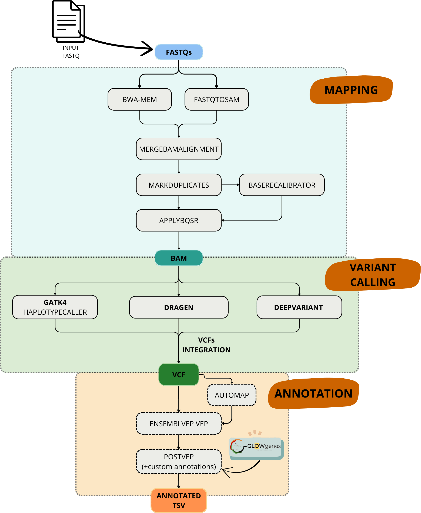

# Introduction

**nf-CBRA-snvs** (nf-core - CIBERER Bioinformatics for Rare diseases Analysis - Small Nucleotide Variant) is a workflow optimized for the analysis of rare diseases, designed to detect SNVs and INDELs in targeted sequencing data (CES/WES) as well as whole genome sequencing (WGS).

This pipeline is developed using Nextflow, a workflow management system that enables an easy execution across various computing environments. It uses Docker or Singularity containers, simplifying setup and ensuring reproducibility of results. The pipeline assigns a container to each process, which simplifies the management and updating of software dependencies. When possible, processes are sourced from nf-core/modules, promoting reusability across all nf-core pipelines and contributing to the broader Nextflow community.

<p align="center">
    
</p>

# Pipeline summary

The pipeline can perform the following steps:

- **Mapping** of the reads to reference (BWA-MEM)
- Process BAM file (`GATK MarkDuplicates`, `GATK BaseRecalibrator` and `GATK ApplyBQSR`)
- **Variant calling** with the following tools:

  - GATK4 Haplotypecaller (`run_gatk = true`). This subworkflow includes:
    - **GATK4 Haplotypecaller**.
    - **Hard Filters** and **VarianFiltration** to mark PASS variants. More information [here](docs/variant_calling.md).
    - **Bcftools Filter** to keep PASS variants on chr1-22, X, Y.
    - **Split Multialletic**.
  - Dragen (`run_dragen = true`). This subworkflow includes:
    - **GATK4 Calibratedragstrmodel**
    - **GATK4 Haplotypecaller** with `--dragen-mode`.
    - **VarianFiltration** with `--filter-expression "QUAL < 10.4139" --filter-name "DRAGENHardQUAL"`to mark PASS variants. More information [here](https://gatk.broadinstitute.org/hc/en-us/articles/4407897446939--How-to-Run-germline-single-sample-short-variant-discovery-in-DRAGEN-mode).
    - **Bcftools Filter** to keep PASS variants on chr1-22, X, Y.
    - **Split Multialletic**.
  - DeepVariant (`run_deepvariant = true`). This subworkflow includes:
    - **DeepVariant makeexamples**: Converts the input alignment file to a tfrecord format suitable for the deep learning model.
    - **DeepVariant callvariants**: Call variants based on input tfrecords. The output is also in tfrecord format, and needs postprocessing to convert it to vcf.
    - **DeepVariant postprocessvariants**: Convert variant calls from callvariants to VCF, and also create GVCF files based on genomic information from makeexamples. More information [here](https://github.com/nf-core/modules/tree/master/modules/nf-core/deepvariant).
    - **Bcftools Filter** to keep PASS variants on chr1-22, X, Y.
    - **Split Multialletic**.

- **Merge and integration** of the vcfs obtained with the different tools.
- **Annotation** of the variants:
  - Regions of homozygosity (ROHs) with [AUTOMAP](https://github.com/mquinodo/AutoMap)
  - Effect of the variants with [Ensembl VEP](https://www.ensembl.org/info/docs/tools/vep/index.html) using the flag `--everything`, which includes the following options: `--sift b, --polyphen b, --ccds, --hgvs, --symbol, --numbers, --domains, --regulatory, --canonical, --protein, --biotype, --af, --af_1kg, --af_esp, --af_gnomade, --af_gnomadg, --max_af, --pubmed, --uniprot, --mane, --tsl, --appris, --variant_class, --gene_phenotype, --mirna`
  - Postvep format VEP tab demilited output and filter variants by minor allele frequency (`--maf`).
  - You can enhance the annotation by incorporating gene rankings from [GLOWgenes](https://www.translationalbioinformaticslab.es/tblab-home-page/tools/glowgenes), a network-based algorithm developed to prioritize novel candidate genes associated with rare diseases. Precomputed rankings based on PanelApp gene panels are available [here](https://github.com/TBLabFJD/GLOWgenes/blob/master/precomputed_panelAPP/GLOWgenes_precomputed_panelAPP.tsv). To include a specific GLOWgenes ranking, use the option `--glowgenes_panel (path to the panel.txt)`, for example: `--glowgenes_panel https://raw.githubusercontent.com/TBLabFJD/GLOWgenes/refs/heads/master/precomputed_panelAPP/GLOWgenes_prioritization_Neurological_ciliopathies_GA.txt`. Additionally, you can include the Gene-Disease Specificity Score (SGDS) using: `--glowgenes_sgds https://raw.githubusercontent.com/TBLabFJD/GLOWgenes/refs/heads/master/SGDS.csv`. This score ranges from 0 to 1, where 1 indicates a gene ranks highly for only a few specific diseases (high specificity), and 0 indicates the gene consistently ranks highly across many diseases (low specificity).


# Usage

First, prepare a samplesheet with your input data:

```
sample,fastq_1,fastq_2
SAMPLE_PAIRED_END,/path/to/fastq/files/AEG588A1_S1_L002_R1_001.fastq.gz,/path/to/fastq/files/AEG588A1_S1_L002_R2_001.fastq.gz
```

Each row represents a pair of paired end fastq files. 

You can run the pipeline using: 

```
nextflow run nf-cbra-snvs/main.nf \
   -profile <docker/singularity/.../institute> \
   --input samplesheet.csv \
   --outdir <OUTDIR>
```

For more details and further functionality, please refer to the [usage](docs/usage.md) documentation.


# Pipeline output

For details about the output files and reports, please refer to the [output](docs/output.md) documentation.

# Credits

nf-CBRA-snvs was developed within the framework of a call for intramural cooperative and complementary actions (ACCI) funded by CIBERER (Biomedical Research Network Centre for Rare Diseases).

**Main Developer**
- [Yolanda Benítez Quesada](https://github.com/yolandabq)

**Coordinator**
- [Carlos Ruiz Arenas](https://github.com/yocra3)

**Other contributors**
- [Graciela Uría Regojo](https://github.com/guriaregojo)
- [Pedro Garrido Rodríguez](https://github.com/pedro-garridor)
- [Rafa Farias Varona](https://github.com/RafaFariasVarona)
- [Pablo Minguez](https://github.com/pminguez)
- [Daniel Lopez](https://github.com/dlopez-bioinfo)


